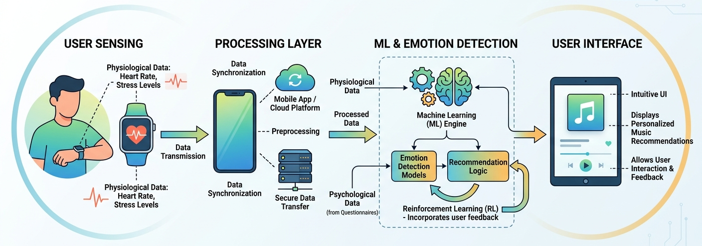

# 🎵 Adaptive Learning Multimodal AI Music Recommendation System

  

---

## Project Overview

The Adaptive Learning Multimodal AI Music Recommendation System (AIMRS) is an AI-powered personalized music recommendation platform designed to help users reduce stress and improve emotional well-being through intelligent music selection.

The system combines:

* Physiological signals(HR, Stress index) from wearable devices
* Psychological assessment questionnaires(DASS, TIPI, WHOQOL)
* User music preferences and feedback

Using adaptive learning techniques, the recommendation engine continuously improves recommendations based on user responses and listening behavior.

---

## Project Objective

To develop an intelligent recommendation system capable of:

* Detecting user emotional and stress conditions
* Understanding personality and quality-of-life indicators
* Providing personalized music recommendations
* Adapting recommendations through continuous feedback learning
* Supporting stress reduction and mental wellness

---

## Sustainable Development Goal (SDG)

### SDG 3 – Good Health and Well-Being

This project contributes toward improving mental wellness by providing personalized music interventions aimed at reducing stress and enhancing emotional balance.

---

## Academic Information

**Project Title:** Adaptive Learning Multimodal AI Music Recommendation System

**Department:** Electronics & Telecommunication Engineering

**Academic Year:** 2025–26

**Project Type:** B.E. Final Year Project

**Institution:** Fr. Conceicao Rodrigues Institute of Technology (FCRIT), Vashi, Navi Mumbai
